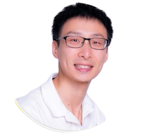

---
# the default layout is 'page'
icon: fas fa-info-circle
order: 4
--- 

## OPEN G.R.S. 

Growth is a open journey to discovery, explore and practice better ways to deliver P.E.A.C.E

  * **P**roduct
  * **E**fficiency
  * **A**ttainment
  * **C**uriosity
  * **E**xperience 

Essential of learning is to undertand principles of the world, build perosnalised knowledge systems and apply the best practices to produce information. There are four pillars[1] in information economics:

* Wealth is knowledge 
* Growth is learning
* Money is time
* Information is surprise.

## Team

Founder

 
Wenyan is an engineer and continuous learning practitioner. He is passionate to develop the best practices to discover, understand, apply principles in real world from various areas:
  * Computer science
  * Software engineering
  * System dynamics
  * Economics
  * History
  * Business and Mangement
  * Psychology

### Refernce
[1] George Gilder 2024  "Life after Capitalism: The Meaning of Wealth, the Future of the Economy, and the Time Theory of Money"